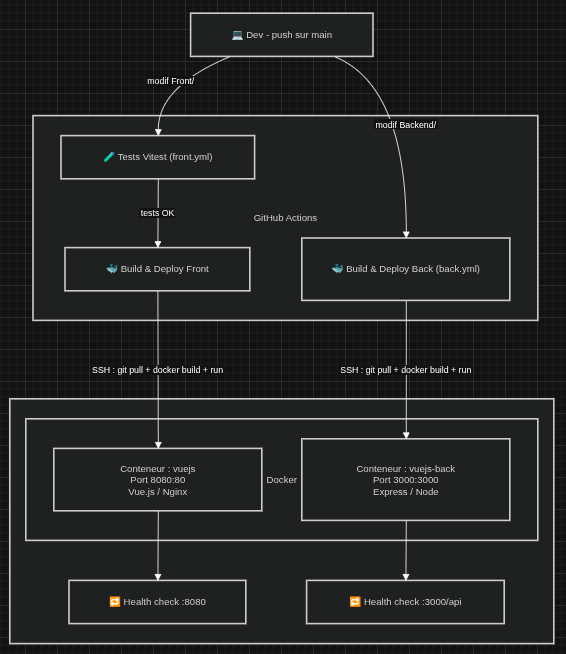

# VueJS — Application Web

> Projet utilisant Vue.js en **Composition API**.

---

## Fonctionnalités réalisées

### Composant NavBar

- J'ai utilisé Vue Router pour la navigation avec `RouterLink`. (`src/components/partials/navbar.vue`)

### Bibliothèque de composants

- J'ai utilisé Shadcn UI. On le voit notamment avec les Cards et Button dans `Form.vue`.

### Formulaire multi-étapes

- Formulaire en 3 étapes avec possibilité de revenir en arrière. (`src/components/form.vue`)

### Transitions entre les pages

- Transition appliquée entre les étapes du formulaire. (`src/components/form.vue`)

### API REST

- J'ai refait une API avec Express dans le backend et j'ai essayé d'utiliser Axios pour les appels REST.

### Tests

- J'ai utilisé Vitest. (`src/components/__tests__/form.spec.js`)

### CI/CD sur VPS

- CI/CD fait à l'aide de l'IA. Workflows dans `.github/workflows/back.yml` et `front.yml`.
- Les deux se connectent au VPS en SSH, font un `git pull`, rebuild l'image Docker, redémarrent le conteneur et vérifient que ça répond.
- Le Front est déclenché seulement si les tests passent.

## Cartographie

Je t'ai fais une petite carto de déploiement (très vite fais donc pas hyper bien mais j'en avait besion pour etre ok avec ce que je voulait faire)


---

## Arborescence

```text
.
├── Front/                        # Application Vue.js
│   ├── src/
│   │   ├── components/
│   │   │   ├── form.vue          # Formulaire multi-étapes
│   │   │   ├── partials/
│   │   │   │   └── navbar.vue    # Barre de navigation
│   │   │   ├── ui/               # Composants Shadcn UI
│   │   │   └── __tests__/
│   │   │       └── form.spec.js  # Tests Vitest
│   │   ├── views/                # Pages (HomeView, Contact, Preview)
│   │   ├── router/index.js       # Configuration Vue Router
│   │   ├── services/api.js       # Appels REST avec Axios
│   │   └── main.js
│   ├── Dockerfile
│   └── vite.config.js
│
├── Backend/                      # API Express
│   ├── routes/api.js             # Routes de l'API
│   ├── prisma/schema.prisma      # Schéma base de données
│   ├── lib/prisma.js             # Client Prisma
│   ├── app.js                    # Point d'entrée
│   └── Dockerfile
│
└── .github/
    └── workflows/
        ├── front.yml             # CI/CD Front (tests + deploy)
        └── back.yml              # CI/CD Back (deploy)
```

---

## Ressources internes

| Ressource         | Fait |
| ----------------- | ---- |
| Stockage interne  | ❌   |
| Notification      | ✅   |
| Nombre d'alertes  | ❌   |
| Partage           | ❌   |
| Contact Picker    | ❌   |
| Géolocalisation   | ❌   |
| Touch event       | ❌   |

---

## Docker

Le tout est conteneurisé et déployé sur mon VPS.